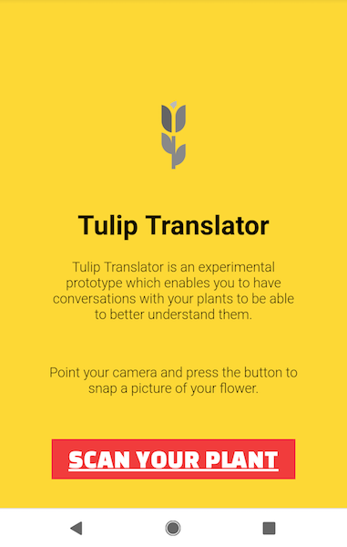
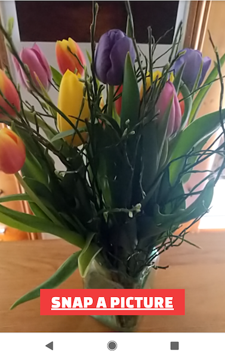
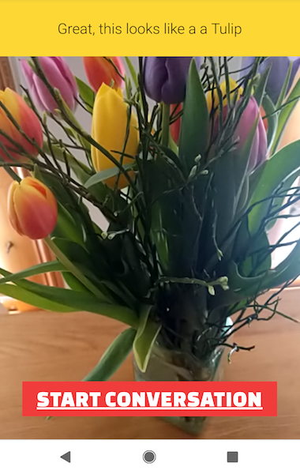

# Tulip Translator

**Disclaimer: This example is made by Lee Boonstra, Customer Engineer @ Google Cloud. Written code can be used as a baseline, it's not meant for production usage, and is not an official Google product**

**Copyright 2019 Google LLC. This software is provided as-is, without warranty or representation for any use or purpose. Your use of it is subject to your agreements with Google.**  

#

Always been curious to learn what your plants and flowers would say if they could talk?  With Tulip Translator you can have a (mock) conversation with your favorite flower. But beware, it has an attitude :)

1. Build the code, and deploy it on Google App Engine Flex.

2. Point your Pixel's camera at a flower, and snap a picture.

3. The Google Cloud AutoML Vision model, will detect your flower, and return the results on the screen.

4. Hold the button and ask a question to Start the Conversation!

  

## Powered by Google Cloud

This experiment showcases the power of Google Cloud, and uses the following building blocks:

* The client application (**src/client**) is written in TypeScript, enables the Camera & Microphone throught HTML5 browser APIs (`navigator.getUserMedia`), and talks via WebSockets to the Node.js server .
* The server application (**src/server**) is written in Node.js. It deploys to AppEngine Flex and has the integration to different Cloud Platform services used:
  * [AutoML with a Flower Dataset](https://github.com/GoogleCloudPlatform/tulip/blob/master/tutorial_automl.md) checks the photo to identify the flower
  * [DialogFlow Enterprise](https://github.com/GoogleCloudPlatform/tulip/blob/master/tutorial_dialogflow.md) carries the conversational flow
  * including the features: *Dialogflow Speech-to-Text* for intent matching via voice and *Dialogflow Text-to-Speech* to generate the flower's speech

If you'd like to try it yourself, see the tutorial instructions below to [Set up the DialogFlow Agent](https://github.com/GoogleCloudPlatform/tulip/blob/master/tutorial_dialogflow.md), train the [AutoML model](https://github.com/GoogleCloudPlatform/tulip/blob/master/tutorial_automl.md), and [run the code locally or deploy to AppEngine Flex](#setup-development-machine).

## Setup Development Machine

. Rename *env.txt* to *.env* and change the variables.

Install NVM: https://github.com/creationix/nvm and use it to install Node 11:

`nvm i`

Install Yarn: https://yarnpkg.com/en/docs/install

Install dependencies:

`yarn`

. Then run:

`./setup.sh`

First build the TypeScript files to JS:

`yarn build`

Start the application, it runs on port: 8080

`yarn start`

## Deploy to AppEngine Flex

`gcloud app deploy`

## Debug info

To help with debugging the deployment you can SSH into your instance through the dashboard:
https://console.cloud.google.com/appengine/instances

From there you can run `docker ps` to find the ID of your container.

Then run something like `docker exec -i -t 04473eaa2bb4 /bin/bash`. Make sure to replace the ID with the ID of your container.

## Authentication

Authentication is typically done through `Application Default Credentials`,
which means you do not have to change the code to authenticate as long as
your environment has credentials. You have a few options for setting up
authentication:

1. When running locally, use the `Google Cloud SDK`

        gcloud auth application-default login

    Note that this command generates credentials for client libraries. To authenticate the CLI itself, use:
    
        gcloud auth login

2. You can create a `Service Account key file`. 
   You need to create a Service Account key file. This file can be used to authenticate to Google Cloud Platform services.

   This file can be used to
   authenticate to Google Cloud Platform services from any environment. To use
   the file, set the ``GOOGLE_APPLICATION_CREDENTIALS`` environment variable to
   the path to the key file, for example:

        export GOOGLE_APPLICATION_CREDENTIALS=~/Documents/keys/project-name.json

* [Application Default Credentials]( https://cloud.google.com/docs/authentication#getting_credentials_for_server-centric_flow)
* [Additional scopes](https://cloud.google.com/compute/docs/authentication#using)
* [Service Account key file](https://developers.google.com/identity/protocols/OAuth2ServiceAccount#creatinganaccount)

#

This is the DIY version of the Tulip Translator app. 

For more info see: [Technical Documentation](https://medium.com/google-cloud/google-tulip-the-technical-details-719c317bf2df) - blog post by Lak Lakshmanan.

**Disclaimer: This example is made by Lee Boonstra, Customer Engineer @ Google Cloud. Written code can be used as a baseline, it's not meant for production usage, and is not an official Google product.**

**Copyright 2019 Google LLC. This software is provided as-is, without warranty or representation for any use or purpose. Your use of it is subject to your agreements with Google.**  
